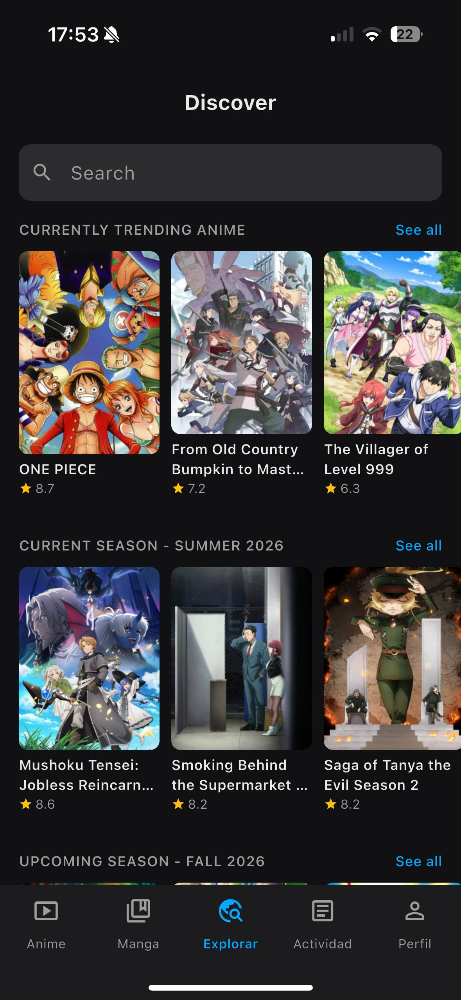
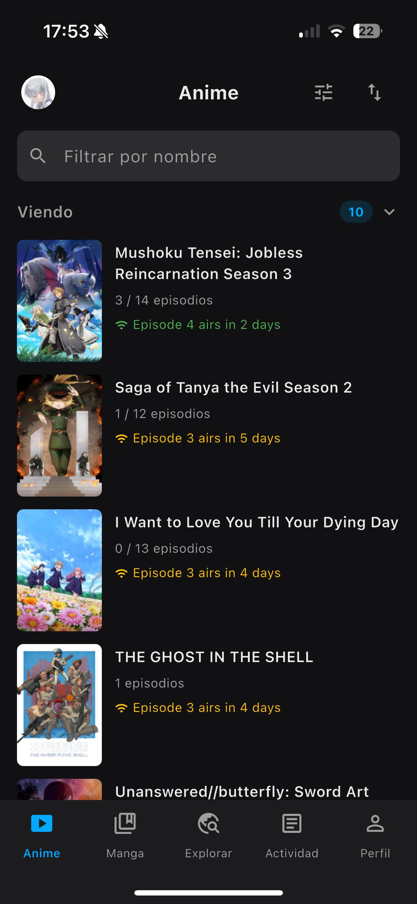
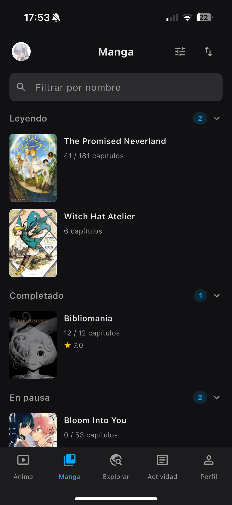
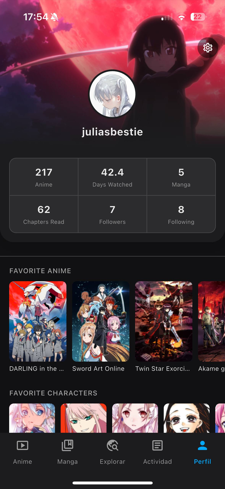
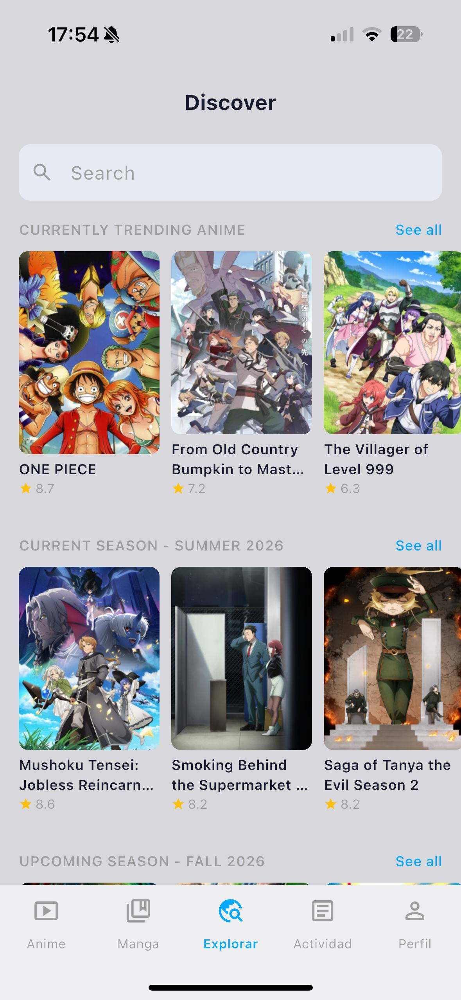
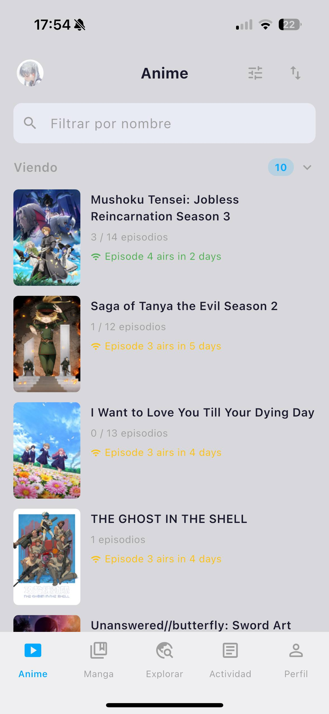
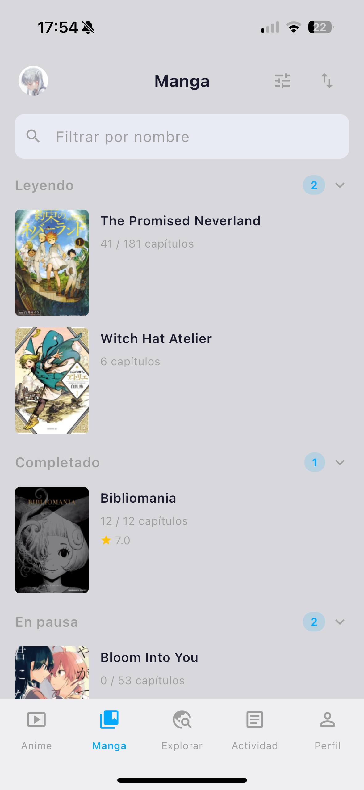
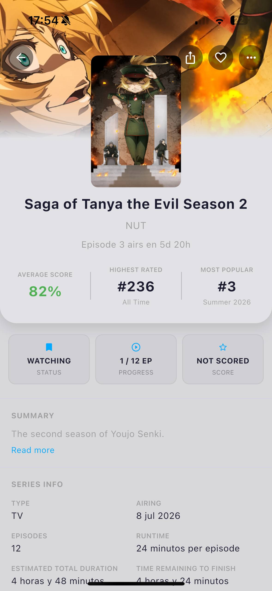
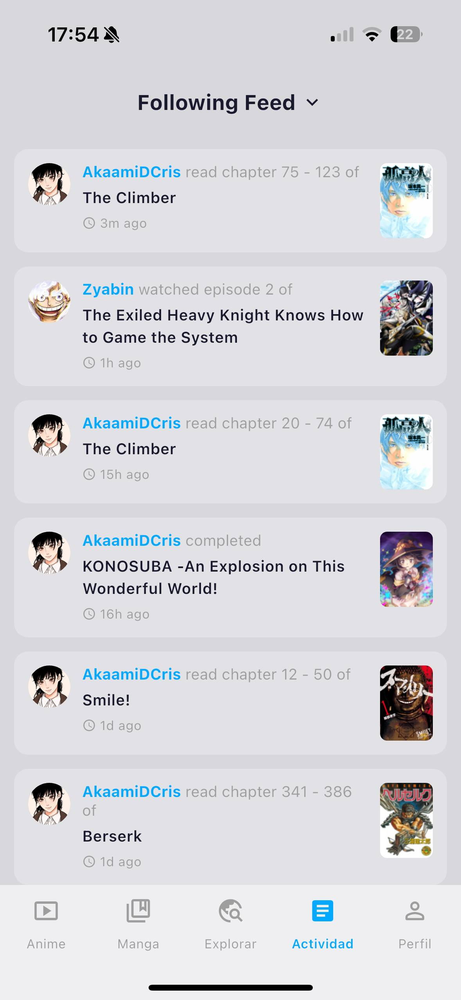
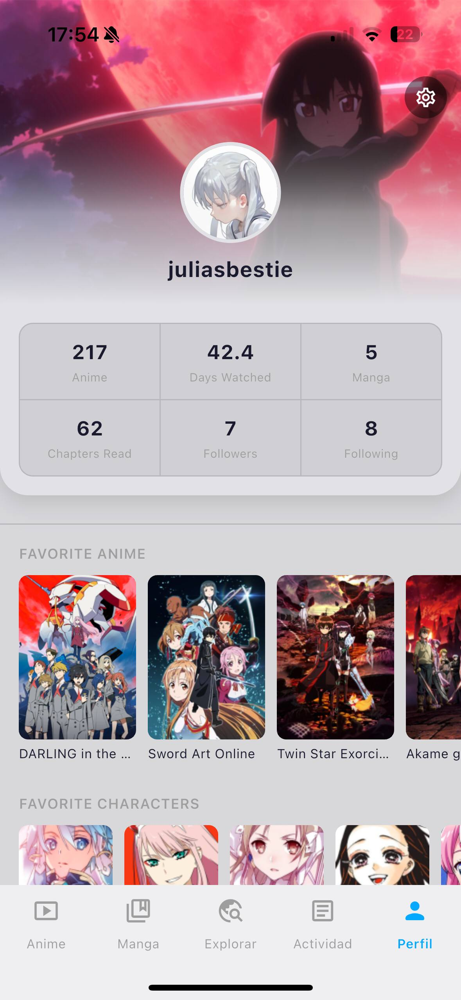

# AniSpark

**Your personal anime & manga tracker, powered by AniList.**

---

## ✨ Features

- 📺 **Track anime & manga** — synced with your AniList account in real time
- 🔔 **Episode alerts** — get notified when a new episode of your current anime airs
- 🌍 **Discover** — trending, seasonal, upcoming and top-rated content at a glance
- 📰 **Activity feed** — see what the people you follow are watching and reading
- 👤 **User profiles** — browse anyone's list, favourites and stats
- 🌓 **Light & dark mode** — full support for both themes
- 🌐 **Multilingual** — English, Spanish, Japanese, French, German, Portuguese, Italian and Korean

---

## 📱 Screenshots

### Dark mode

<table>
  <tr>
    <td align="center"> Discover</td>
    <td align="center"> Anime List</td>
    <td align="center"> Manga List</td>
  </tr>
  <tr>
    <td align="center"> Detail View</td>
    <td align="center"> Activity Feed</td>
    <td align="center"> Profile</td>
  </tr>
</table>

### Light mode

<table>
  <tr>
    <td align="center"> Discover</td>
    <td align="center"> Anime List</td>
    <td align="center"> Manga List</td>
  </tr>
  <tr>
    <td align="center"> Detail View</td>
    <td align="center"> Activity Feed</td>
    <td align="center"> Profile</td>
  </tr>
</table>

---

## 🛠 Tech Stack

| | |
|---|---|
| **Framework** | Flutter 3.41 (Dart) |
| **API** | AniList GraphQL |
| **Auth** | OAuth 2.0 — Authorization Code (mobile) / Implicit (web) |
| **Storage** | Hive (local), SharedPreferences |
| **State** | Provider |
| **Notifications** | flutter\_local\_notifications |
| **Image cache** | cached\_network\_image |

---

## 📲 Install on iOS (Sideload)

> Requires [Sideloadly](https://sideloadly.io/) and a free Apple ID.

1. Download the latest `.ipa` from [Releases](https://github.com/t4kina/AniSpark/releases)
2. Open Sideloadly, drag the `.ipa` and connect your iPhone
3. Enter your Apple ID and hit **Start**
4. On your iPhone: **Settings → General → VPN & Device Management** → trust the certificate
5. Open AniSpark and log in with your AniList account

---

## 🔗 Connect with AniList

AniSpark uses your AniList account to sync your lists, track progress and send episode notifications. Log in from the Profile tab — no separate account needed.

---

Made with ❤️ and Flutter &nbsp;·&nbsp; Data provided by [AniList](https://anilist.co)

